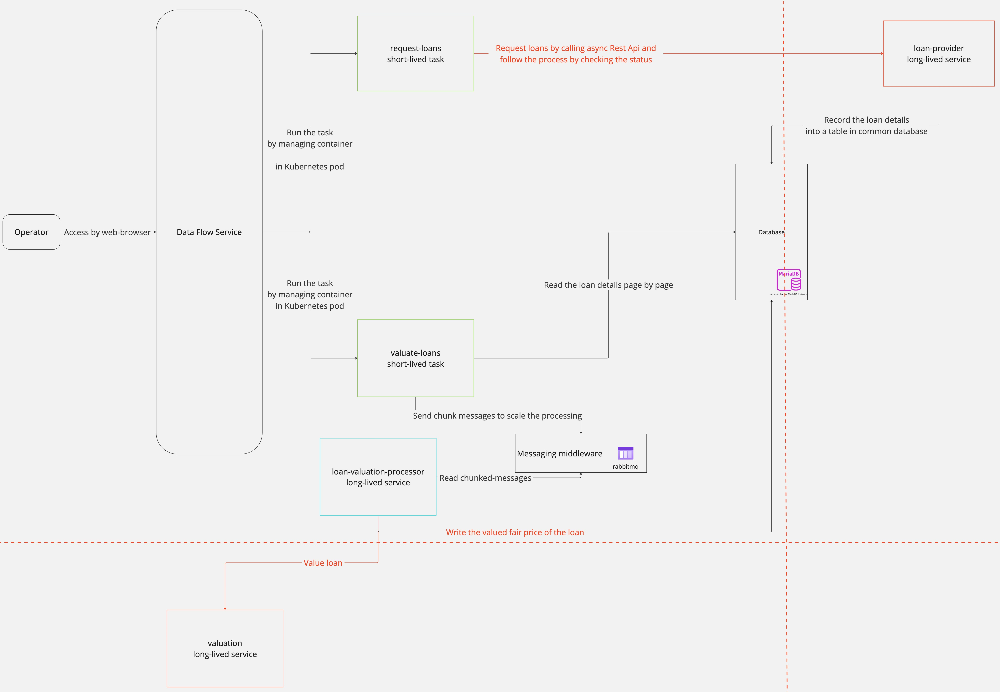

# About the Repository
Repository of a demo project for the assignment (Cloud Provisioning and Deployment & The Business Case for Cloud Computing) 
of a course "Applied Computing and Big Data" offered by Blekinge Institute of Technology.

The main purpose of this repository is to create a microservice-based application (which is deployable using Kubernetes) 
that addresses a business case solved by cloud computing.

## Business Case: Loan Valuation
In this business case, a finance company wants to sell the loans (which it lent to their customers) to the third parties 
by giving a [fair value](https://www.investopedia.com/terms/f/fairvalue.asp) to them.

As part of the process to value a loan for its price, there are a couple of things that needs to be taken into account 
while designing the whole architecture: 
* all the loans given to the customers are managed and exported to other systems by a service (accessed by a Rest API) 
managed by other teams. 
* fair value calculation is done by a model run in another service which we have to use by calling their a Rest API 
with the loan information, in which it requires `installment` (3/6/12 months) and a loan `amount` (customer debt for the loan).

And the system we design must run at the beginning of each day, get the loan information and finalize the valuation process 
in a timely manner to calculate the valuated total price of the loans and present the portfolio to the investors.

## Architecture Diagram & Software Components
For the purpose in the business case, we design a Batch/Stream Data Flow Pipeline which will manage the batch operations 
and processors and scale properly according to the loan data:


* **Operator**: System users who access and use the Data Flow service to start and trace the tasks.
* **Data Flow Service**: Spring Cloud Data Flow service which provides microservice-based Streaming and Batch data 
processing for Kubernetes. It also provides a convenient UI to work on.
* **mariadb**: Database service used to store raw loan details and fair value of loans after the valuation.

1. Loan Detail Data Export Flow
* **request-loans task**: A docker-based container managed by Data Flow Service run in a pod as a short-lived task. 
This makes an HTTP request to the external loan-provider service's async API and poll the same service for a successful 
export (to database) of loan detail information.
* **load-provider service**: A standalone service deployed by a Kubernetes Deployment configuration. This provides a Rest API 
to export loan information (which is randomly generated in the implementation) to a common database to be used by loan 
valuation services later on.
 
2. Loan Valuation Flow
* **valuate-loans task**: A docker-based container managed by Data Flow Service run in a pod as a short-lived task.
This reads the loan details on the database as batches and sends this information as a chunked message to the messaging
middleware which will be processed independently.
* **rabbitmq**: Messaging middleware which is used in the loan valuation flow to distribute and scale the valuation process.
* **load-valuation-processer service**: A standalone service deployed by a Kubernetes Deployment configuration. 
This polls the messaging middleware for chunked loan details messages, and makes a Rest API call for each loan to 
external **valuation service**. Finally, write the calculated loan fair value to the database
* **valuation service**: A standalone service deployed by a Kubernetes Deployment configuration.
This provides a Rest API to accept loan information and return the calculated the fair price to the client.

## Architectural Patterns & Design Decisions
`Single service per host` pattern is used because we run the microservices on their own host with their own resources. 
This makes them run and scale independently.
Because multiple microservices use a shared database, it uses `Shared DB server` pattern.
With the usage of a messaging middleware, `Queue-Centric Workflow` pattern applied to distribute the valuation flow 
between services to make it scalable and so on faster.

Managing just one database instance makes it convenient to manage and work, but it also generates security concerns. One 
service can access and change to the other service's data so having specific database user and roles by the services 
so strict access rights (Write/Read from tables) is very important.
Similar security issue is on the Rest APIs as well. We don't use Authentication/Authorization yet, so randomly one
service can trigger the loan data export while it is not intended.
Likewise, Authentication/Authorization is needed on Data Flow UI as well. Possibly, not all the users will have the same 
rights.

## Deployment
To run the whole system, run the following make commands successively:

To install general dependencies like messaging-middleware, database and the data flow server:
```shell
make install-dependencies
```

To install external services that loan valuation depends on the flow (loan-provider and valuation service):
```shell
make install-external-services
```

To install services related to loan valuation directly (setup, valuate-loans, loan-valuation-processor): 
```shell
make install-loan-valuation
```

To get the public IP of Data Flow application to which Operator access by web-browser:  
```shell
minikube service --url scdf-server
```

Now, we can use it on a browser like http://127.0.0.1:55445/dashboard
